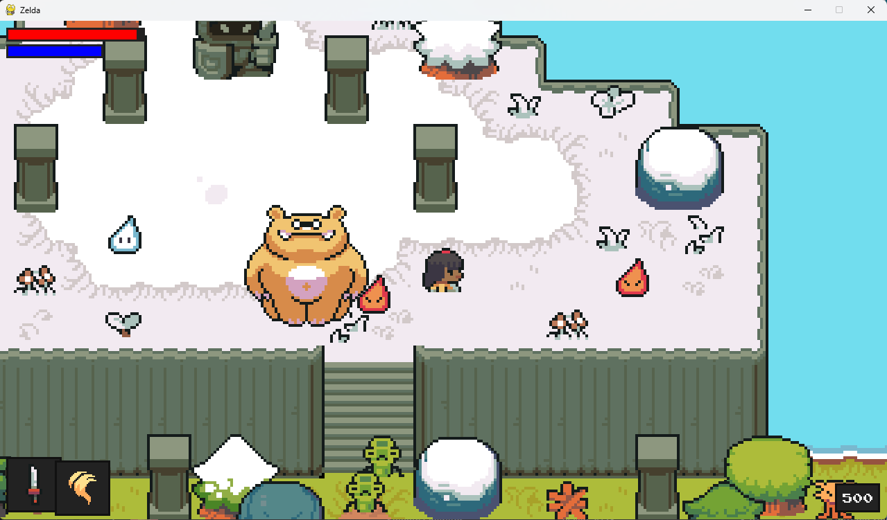

## Zelda style Python game

This is a tutorial provided by Clear Code that brings an introduction to creating a Zelda style game with some Dark Souls elkements created using python graphic library. 

This makes use of all aspects of Pygame espacially OOP. 

Link to youtube video: [Creating a Zelda style game in Python [with some Dark Souls elements]](https://www.youtube.com/watch?v=QU1pPzEGrqw&list=PLH3CJ3zIUwuVAPJQJM56p3TzK2inMwhBh&index=3&t=1s)

Link to Clear Code Github: [Clear Code](https://github.com/clear-code-projects)